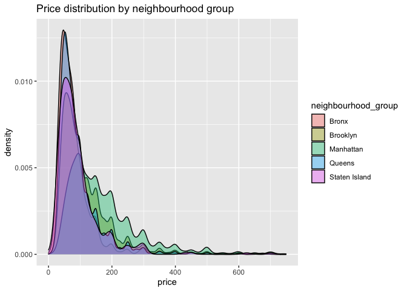

``` r
library(tidyverse)
```

    ## ── Attaching packages ─────────────────────────────────────── tidyverse 1.3.0 ──

    ## ✓ ggplot2 3.3.3     ✓ purrr   0.3.4
    ## ✓ tibble  3.0.5     ✓ dplyr   1.0.3
    ## ✓ tidyr   1.1.2     ✓ stringr 1.4.0
    ## ✓ readr   1.4.0     ✓ forcats 0.5.0

    ## ── Conflicts ────────────────────────────────────────── tidyverse_conflicts() ──
    ## x dplyr::filter() masks stats::filter()
    ## x dplyr::lag()    masks stats::lag()

``` r
library(dplyr)
library(VIM)
```

    ## Loading required package: colorspace

    ## Loading required package: grid

    ## VIM is ready to use.

    ## Suggestions and bug-reports can be submitted at: https://github.com/statistikat/VIM/issues

    ## 
    ## Attaching package: 'VIM'

    ## The following object is masked from 'package:datasets':
    ## 
    ##     sleep

``` r
library(readr)
```

``` r
airbnb <- read_csv("/Users/aniketsingh/AirBnbSeniorProject/data/AB_NYC_2019.csv")
```

    ## 
    ## ── Column specification ────────────────────────────────────────────────────────
    ## cols(
    ##   id = col_double(),
    ##   name = col_character(),
    ##   host_id = col_double(),
    ##   host_name = col_character(),
    ##   neighbourhood_group = col_character(),
    ##   neighbourhood = col_character(),
    ##   latitude = col_double(),
    ##   longitude = col_double(),
    ##   room_type = col_character(),
    ##   price = col_double(),
    ##   minimum_nights = col_double(),
    ##   number_of_reviews = col_double(),
    ##   last_review = col_date(format = ""),
    ##   reviews_per_month = col_double(),
    ##   calculated_host_listings_count = col_double(),
    ##   availability_365 = col_double()
    ## )

``` r
# Imputing the missing values of the column reviews_per_month to 0.
airbnb$reviews_per_month[is.na(airbnb$reviews_per_month)] <- 0

newdata <- select(airbnb, -id, -name, -host_id, -host_name)
str(newdata)
```

    ## tibble [48,895 × 12] (S3: tbl_df/tbl/data.frame)
    ##  $ neighbourhood_group           : chr [1:48895] "Brooklyn" "Manhattan" "Manhattan" "Brooklyn" ...
    ##  $ neighbourhood                 : chr [1:48895] "Kensington" "Midtown" "Harlem" "Clinton Hill" ...
    ##  $ latitude                      : num [1:48895] 40.6 40.8 40.8 40.7 40.8 ...
    ##  $ longitude                     : num [1:48895] -74 -74 -73.9 -74 -73.9 ...
    ##  $ room_type                     : chr [1:48895] "Private room" "Entire home/apt" "Private room" "Entire home/apt" ...
    ##  $ price                         : num [1:48895] 149 225 150 89 80 200 60 79 79 150 ...
    ##  $ minimum_nights                : num [1:48895] 1 1 3 1 10 3 45 2 2 1 ...
    ##  $ number_of_reviews             : num [1:48895] 9 45 0 270 9 74 49 430 118 160 ...
    ##  $ last_review                   : Date[1:48895], format: "2018-10-19" "2019-05-21" ...
    ##  $ reviews_per_month             : num [1:48895] 0.21 0.38 0 4.64 0.1 0.59 0.4 3.47 0.99 1.33 ...
    ##  $ calculated_host_listings_count: num [1:48895] 6 2 1 1 1 1 1 1 1 4 ...
    ##  $ availability_365              : num [1:48895] 365 355 365 194 0 129 0 220 0 188 ...

``` r
numericData <- select(newdata,price,latitude,longitude,minimum_nights,number_of_reviews,reviews_per_month,calculated_host_listings_count,availability_365)

charData <- select(newdata,price, neighbourhood_group, neighbourhood, room_type)

timeData <- select(newdata, price, last_review)
```

Univariate Graphs of Character Variables

``` r
ggplot(charData, aes(x = neighbourhood_group,y = ..count.. / sum(..count..))) + 
  geom_bar(fill = "yellow",
color="black") +
  labs(x = "Neighbourhood Group",
       y = "Frequency") +
  scale_y_continuous(labels = scales::percent)
```

<!-- -->

``` r
ggplot(charData, aes(x = room_type,y = ..count.. / sum(..count..))) + 
  geom_bar(fill = "red",
color="black") +
  labs(x = "Room type",
       y = "Frequency") +
  scale_y_continuous(labels = scales::percent)
```

<!-- -->

Univariate Graphs of Numeric Variables

``` r
ggplot(filter(numericData,price < 1050), aes(x = price,y= ..count.. / sum(..count..))) + geom_histogram(fill = "cornflowerblue",
color = "white",bindwidth = 50) +
labs(title = "Price Distribution",
x = "Price") + scale_y_continuous(labels = scales::percent)
```

    ## Warning: Ignoring unknown parameters: bindwidth

    ## `stat_bin()` using `bins = 30`. Pick better value with `binwidth`.

<!-- -->

``` r
ggplot(filter(numericData,minimum_nights < 35), aes(x = minimum_nights,y= ..count.. / sum(..count..))) + geom_histogram(fill = "cornflowerblue",
color = "white", bindwidth = 1) +
labs(title = "Minimum Nights Distribution",
x = "Minimum nights") + scale_y_continuous(labels = scales::percent)
```

    ## Warning: Ignoring unknown parameters: bindwidth

    ## `stat_bin()` using `bins = 30`. Pick better value with `binwidth`.

<!-- -->

``` r
ggplot(filter(numericData,number_of_reviews < 250), aes(x = number_of_reviews,y= ..count.. / sum(..count..))) + geom_histogram(fill = "cornflowerblue",
color = "white", bindwidth = 1) +
labs(title = "Distribution of number_of_reviews",
x = "Number Of Reviews") + scale_y_continuous(labels = scales::percent)
```

    ## Warning: Ignoring unknown parameters: bindwidth

    ## `stat_bin()` using `bins = 30`. Pick better value with `binwidth`.

<!-- -->

``` r
ggplot(filter(numericData,reviews_per_month < 11), aes(x = reviews_per_month,y= ..count.. / sum(..count..))) + geom_histogram(fill = "cornflowerblue",
color = "white", bindwidth = 1) +
labs(title = "Distribution of reviews_per_month",
x = "Reviews per month") + scale_y_continuous(labels = scales::percent)
```

    ## Warning: Ignoring unknown parameters: bindwidth

    ## `stat_bin()` using `bins = 30`. Pick better value with `binwidth`.

<!-- -->

``` r
ggplot(filter(numericData,calculated_host_listings_count < 40), aes(x = calculated_host_listings_count,y= ..count.. / sum(..count..))) + geom_histogram(fill = "cornflowerblue",
color = "white", bins= 30) +
labs(title = "Distribution of calculated_host_listings_count",
x = "Calculated Host Listings Count") + scale_y_continuous(labels = scales::percent)
```

<!-- -->

``` r
ggplot(numericData, aes(x = availability_365,y= ..count.. / sum(..count..))) + geom_histogram(fill = "cornflowerblue",
color = "white", bins= 30) +
labs(title = "Distribution of availability_365",
x = "Number of available days in a year") + scale_y_continuous(labels = scales::percent)
```

<!-- -->

Bivariate Graphs

``` r
ggplot(charData,
aes(x = neighbourhood_group,
fill = neighbourhood)) + geom_bar(position = "fill") +
labs(y = "Proportion")
```

<!-- -->

``` r
ggplot(charData,
aes(x = neighbourhood_group,
fill = room_type)) + geom_bar(position = "fill") +
labs(y = "Proportion")
```

<!-- -->
Kernel Density plot for quantitative vs categorical variables

``` r
ggplot(filter(charData,price < 750),
aes(x = price, fill = neighbourhood_group)) +
geom_density(alpha = 0.4) +
labs(title = "Price distribution by neighbourhood group")
```

<!-- --> Distribution
using violin and box plots.

``` r
ggplot(charData, aes(x = neighbourhood_group,
y = price)) + geom_violin(fill = "cornflowerblue") + geom_boxplot(width = .01,
fill = "orange", outlier.color = "orange", outlier.size = 2) +
labs(title = "Price distribution by neighbourhood group")
```

<!-- -->
